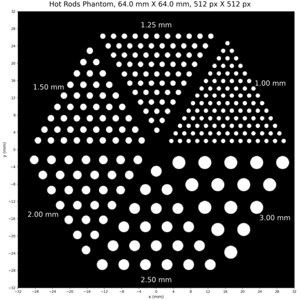

# Digital Phantoms

A package for generating, visualizing, and working with digital phantoms, such as hot rods phantoms, for imaging research and testing.

## Authors

| Name          | Email                      |
| -------------- | ------------------------- |
| Fang Han      | <fhanonline@gmail.com>     |

## Features

- Purely `PyTorch` implementation
- Generate 2D phantom images (e.g., hot rods)
- Save and load phantom images in `PyTorch` format
- Visualize and plot phantoms with `matplotlib`
- Utilities for geometric transformations and disk/sector generation

## Installation

Clone this repository and install dependencies as needed:

```bash
git clone https://github.com/spebt/digital_phantoms.git
cd digital_phantoms
# (Optional) Create a virtual environment
pip install -r requirements.txt  # if requirements.txt exists
```

## Usage

Example: Generate and plot a hot rods phantom

```bash
python code/create_hot_rods_phantom.py
python code/plot_hot_rods_phantom.py <phantom_dot_pt_file_path>
```

Or use the Jupyter notebooks in the `code/` directory for interactive exploration.

## Project Structure

- `code/` — Python scripts and Jupyter notebooks for phantom generation and visualization
- `phantoms/` — Generated phantom images and data files
- `assets/` — Thumbnails and example images

## Existing Phantoms

The following example phantoms are included in this repository:

### Hot Rods Phantom (64.0 mm x 64.0 mm)



- Description: A hot rods phantom with a size of 64.0 mm x 64.0 mm, consisting of 512 pixels x 512 pixels,
with a pixel size of 0.125 mm x 0.125 mm.
- Generated using the `create_hot_rods_phantom.py` script.
- Files:
  - PNG image: `assets/hot_rods_phantom_64.0_mm_x_64.0_mm.png`
  - PyTorch tensor: `phantoms/hot_rods_phantom_64.0_mm_x_64.0_mm.pt`

You can use these files for testing, visualization, or as templates for generating new phantoms.

## Contributing

Contributions are welcome! Please open issues or submit pull requests.

## License

[MIT License](LICENSE)
